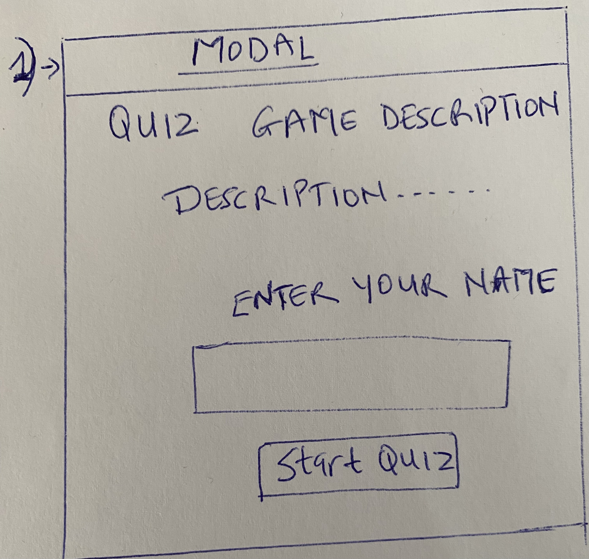
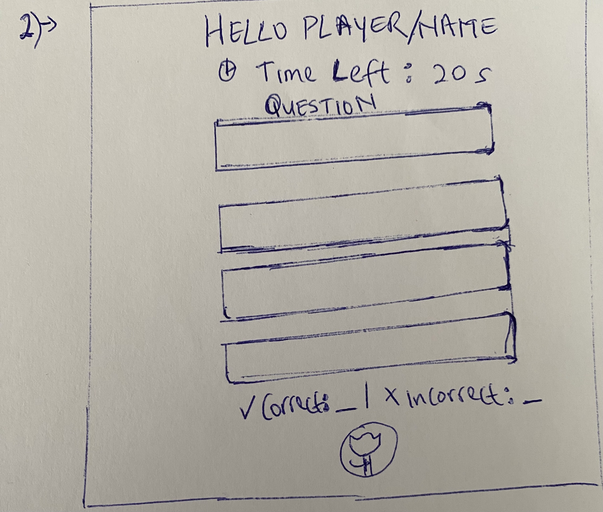
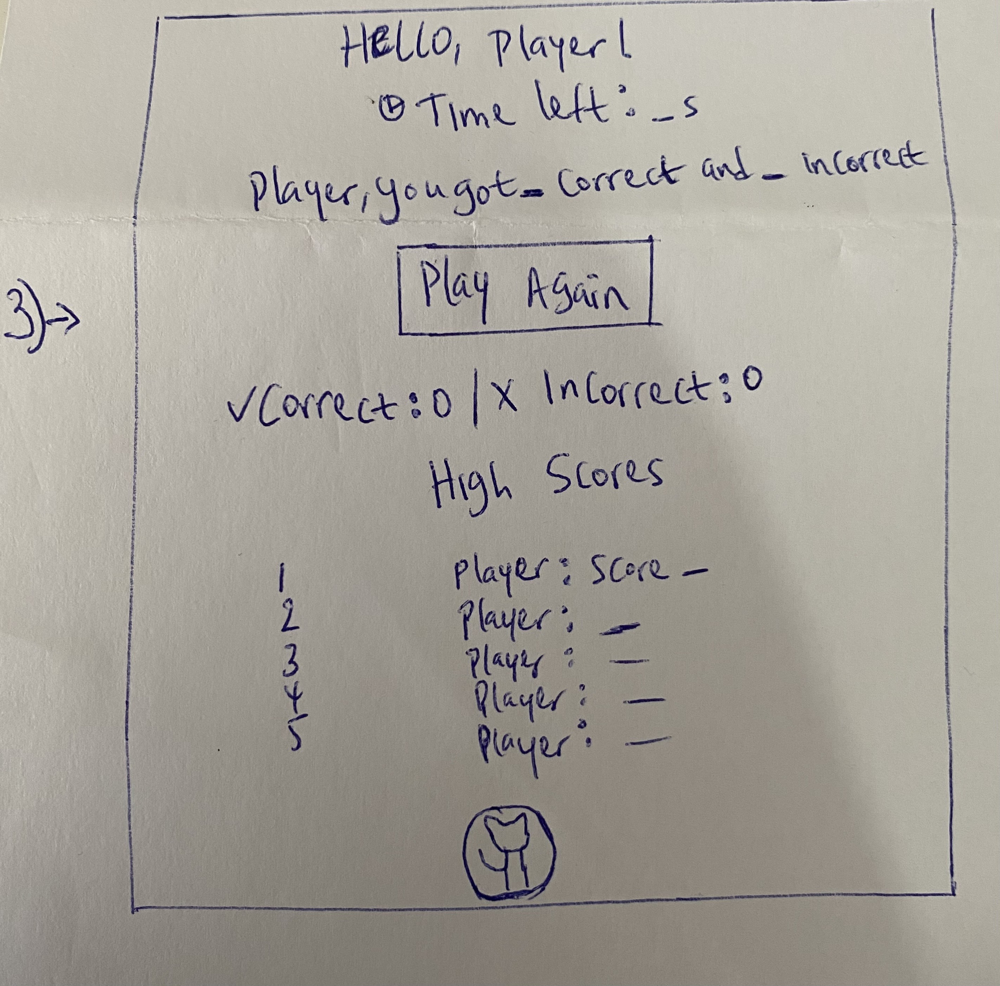
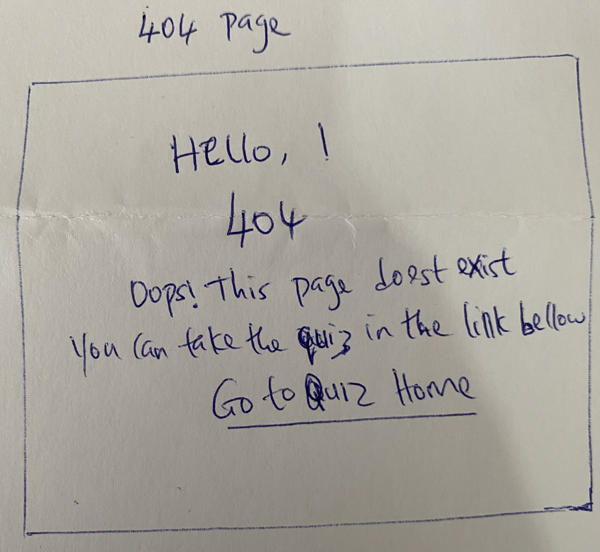
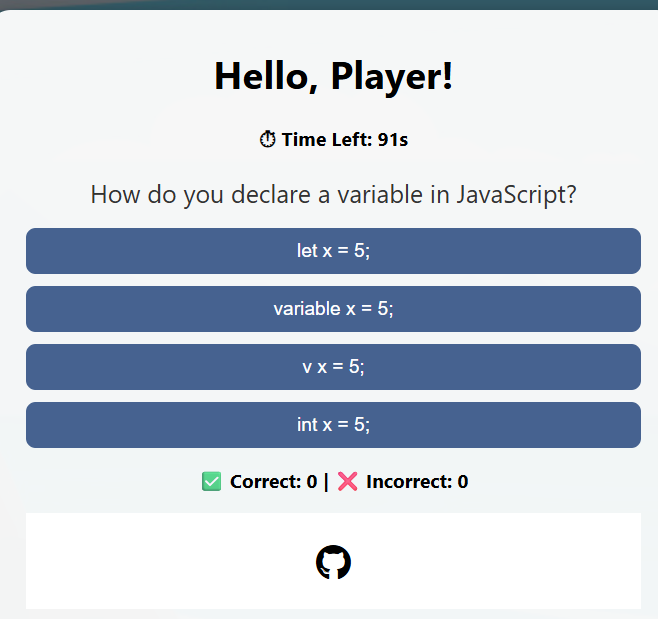
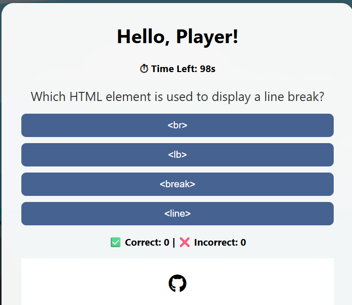

# [pp2-codequiz](https://mairima.github.io/pp2-codequiz)

Developer: Mairi Aissatou ([mairima](https://www.github.com/mairima))

This is an interactive web-based Quiz Game built using HTML, CSS, and JavaScript. The game challenges players with multiple-choice questions presented one at a time. Users enter their name before starting via a modal pop-up. A countdown timer adds urgency. The game includes localStorage integration to save score history for replay value and performance tracking.

**Site Mockups**
*([techsini](https://techsini.com/multi-mockup))*

> [!IMPORTANT]
> The examples in these templates are strongly influenced by the Code Institute walkthrough project called "Love Maths", Tutorial from GreatStack: https://www.youtube.com/watch?v=PBcqGxrr9g8 and AI recomendations. 

## UX

### The 5 Planes of UX

#### 1. Strategy

**Purpose**
- Provide users with some quiz questions to test their knowledge on HTML, CSS and Javascript.
- Deliver instant feedback of answers to improve usability and encourage learning.
- Support accessibility and user-friendly interactions.

**Primary User Needs**
- Users want an engaging way to test their HTML, CSS, and JavaScript knowledge.
- Users expect feedback, scores, and progress tracking.

**Business Goals**
- Create an educational yet fun quiz that improves learning retention.
- Showcase frontend development skills and JavaScript interactivity.

#### 2. Scope

**[Features](#features)** (see below)

**Content Requirements**
- A bank of at least 10 questions (HTML, CSS, JS)
- Instructions and score summary
- Descriptive UI texts and labels

#### 3. Structure

**Information Architecture**
- **Navigation Menu**:
  - Simple navbar with accessible links.
- **Hierarchy**:
- Questions are categorized by topic (HTML, CSS, JS) but shuffled
- Result history stored and optionally viewable

**User Flow**
1. User lands on the home page → reads brief instructions.
2. A modal appears: Brief quiz description, Input for player name, “Start Quiz” button
3. Start Quiz: Timer begins (e.g., 60 seconds)
4. User selects an answer: Button color changes to green/red, Answer buttons become disabled, “Next” button becomes visible
5. End of Quiz; Happens when: All questions are answered OR Time runs out
Final score shown:
Correct & incorrect counts
Personalized message
6. Save Score; Result stored in localStorage: Player name, Score, Time, Option to “Play Again”
7. View History: User can open a section to view past attempts (score history from local storage).

#### 4. Skeleton

**[Wireframes](#wireframes)** (see below)

Interface Design:

Large central quiz box for readability

Timer and score counter visible at the end

Answer buttons styled for interactivity

Feedback for correct/incorrect answers at the end

Navigation Design:

Linear navigation through questions

“Play Again” resets game from the modal

#### 5. Surface

**Visual Design Elements**
- **[Colours](#colour-scheme)** (see below)
- **[Typography](#typography)** (see below)

### Colour Scheme

I used [coolors.co](https://coolors.co/080708-3772ff-df2935-fdca40-e6e8e6) to generate my color palette.

- `#000000` primary text.
- `#341F36` modal text.

### Typography

CSS styles used

## Wireframes

To follow best practice, wireframes were developed for mobile, tablet, and desktop sizes.

| Page | Desktop |
| --- | --- |
| Home-start-modal |  |
| Quiz-content |  |
| Score view  |  |
| 404  |  |

## User Stories

| Target | Expectation | Outcome |
| --- | --- | --- | 
| As a user | I would like open the quiz on all browser windows| so that its flexible to participate |
| As a user| I want to enter my name before starting the quiz| so that my score is visible and personalized.|
| As a user | I would like to see questions and answer options with buttons| so that I can choose the result. | 
| As a user | I would like the application to have clear and large buttons for each operator | so that I can easily select the correct one on any device. |
| As a user | I would like the application to have high-contrast colors and accessible fonts | so that I can easily read and interact with it. |
| As a user | I would liketo see a timer | so that I can be aware of the time used|
| As a user | I would like the app to show me the correct result if my answer was incorrect | so that I can know the correct answer. |
| As a user | I would like to see the score I get| so I can push myself to improve more | 
| As a user | I would like to see a 404 error page if I get lost | so that i recognise when on an inexistent page.|

## Features

### Existing Features

| Feature | Notes | Screenshot |
| --- | --- | --- |
| Start modal | When the user opens the quiz, a modal appears asking for their name. It also provides a brief game description and a "Start Quiz" button. This personalizes the experience and gives users context. |  |
| Multiple-Choice Questions | The quiz pulls from a question bank (e.g., HTML, CSS, JavaScript topics) |  |
| Answer Feedback| When a user selects an answer, immediate visual feedback (color-coded) indicates whether it was correct or incorrect. The correct answer is also highlighted. |  |
| Game Timer | A countdown timer starts when the quiz begins. If the time runs out before the user finishes, the game ends automatically.|  |
|Responsive Design| The entire quiz layout adapts to various screen sizes, ensuring a smooth experience on desktops, tablets, and mobile devices.|  |
|Score Tracking| The user's score is tracked in real-time based on correct answers and shown at the end of the game in a result summary.|(see photo on  Score tracking) |
|Local Storage for Score History| After each game, the user's name, score, and time are saved in localStorage, allowing them to view their quiz history even after refreshing the page.| (see photo on  Score tracking)|
|Replay Functionality| The Users can restart the quiz at the end using the "Play Again" button, resetting the timer, questions, and score.|(See answer feedback photo) |
|Shuffel Function| The question order changes each time the game is replayed, so that the user can test them selfs in remembering the question rather than the order of the previous results.|    |
| 404 | The 404 error page will indicate when a user has somehow navigated to a page that doesn't exist. This replaces the default GitHub Pages 404 page, and ties-in with the look and feel of the *Quiz Website*|  |

### Future Features

Leaderboard: have a leaderboard of top players based on scores and time, connected to a backend.

## Tools & Technologies

| Tool / Tech | Use |
| --- | --- |
|  | Generate README and TESTING templates. |
|  | Version control. (`git add`, `git commit`, `git push`) |
|  | Secure online code storage. |
|  | Main site content and layout. |
|  | Design and layout. |
|  | User interaction on the site. |
|  | Hosting the deployed front-end site. |
|Visual Studio| Tool for coding |
|Font awesome| For icons|

## Agile Development Process

### GitHub Projects

[GitHub Projects](https://github.com/users/mairima/projects/5) served as an Agile tool for this project. Through it, EPICs, User Stories, issues, and Milestone tasks were planned, then subsequently tracked on a regular basis using the Kanban project board.

### MoSCoW Prioritization

I've decomposed my Epics into User Stories for prioritizing and implementing them. Using this approach, I was able to apply "MoSCoW" prioritization and labels to my User Stories within the Issues tab.

- **Must Have**: guaranteed to be delivered - required to Pass the project (*max ~60% of stories*)
- **Should Have**: adds significant value, but not vital (*~20% of stories*)
- **Could Have**: has small impact if left out (*the rest ~20% of stories*)

## Testing

> [!NOTE]
> For all testing, please refer to the [TESTING.md](TESTING.md) file.

## Deployment

### GitHub Pages

The site was deployed to GitHub Pages. The steps to deploy are as follows:

- In the [GitHub repository](https://www.github.com/mairima/pp2-codequiz), navigate to the "Settings" tab.
- In Settings, click on the "Pages" link from the menu on the left.
- From the "Build and deployment" section, click the drop-down called "Branch", and select the **main** branch, then click "Save".
- The page will be automatically refreshed with a detailed message display to indicate the successful deployment.
- Allow up to 5 minutes for the site to fully deploy.

The live link can be found on [GitHub Pages](https://mairima.github.io/pp2-codequiz).

### Local Development

This project can be cloned or forked in order to make a local copy on your own system.

#### Cloning

You can clone the repository by following these steps:

1. Go to the [GitHub repository](https://www.github.com/mairima/pp2-codequiz).
2. Locate and click on the green "Code" button at the very top, above the commits and files.
3. Select whether you prefer to clone using "HTTPS", "SSH", or "GitHub CLI", and click the "copy" button to copy the URL to your clipboard.
4. Open "Git Bash" or "Terminal".
5. Change the current working directory to the location where you want the cloned directory.
6. In your IDE Terminal, type the following command to clone the repository:
	- `git clone https://www.github.com/mairima/pp2-codequiz.git`
7. Press "Enter" to create your local clone.

Alternatively, if using Gitpod, you can click below to create your own workspace using this repository.

**Please Note**: in order to directly open the project in Gitpod, you should have the browser extension installed. A tutorial on how to do that can be found [here](https://www.gitpod.io/docs/configure/user-settings/browser-extension).

#### Forking

By forking the GitHub Repository, you make a copy of the original repository on our GitHub account to view and/or make changes without affecting the original owner's repository. You can fork this repository by using the following steps:

1. Log in to GitHub and locate the [GitHub Repository](https://www.github.com/mairima/pp2-codequiz).
2. At the top of the Repository, just below the "Settings" button on the menu, locate and click the "Fork" Button.
3. Once clicked, you should now have a copy of the original repository in your own GitHub account!

### Local VS Deployment

There are no remaining major differences between the local version when compared to the deployed version online.

## Credits

### Content

| Source | Notes |
| --- | --- |
| [Markdown Builder](https://markdown.2bn.dev) | Help generating Markdown files |
| [GreatStack](https://www.youtube.com/watch?v=PBcqGxrr9g8) | "How to Write a Git Commit Message" |
| [Love Maths](https://codeinstitute.net) | Code Institute walkthrough project inspiration |
| [JavaScript 30](https://javascript30.com) | Additional JS help on day 15 on local storage |
| [ChatGPT](https://chatgpt.com) | Help with code logic and explanations |

### Media

- Images: From the made website.

| Source | Notes |
| --- | --- |
| [favicon.io](https://favicon.io) | Generating the favicon |

### Acknowledgements

- I would like to thank my Code Institute mentor, [Tim Nelson](https://www.github.com/TravelTimN) for the support throughout the development of this project.
- I would like to thank the [Code Institute](https://codeinstitute.net) Tutor Team and facilitator for their assistance or with troubleshooting issues.

