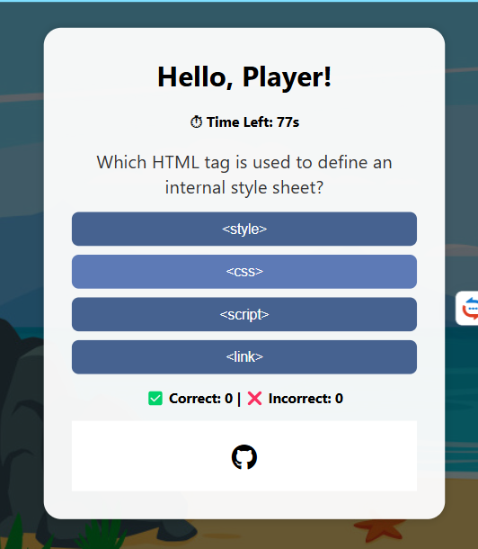
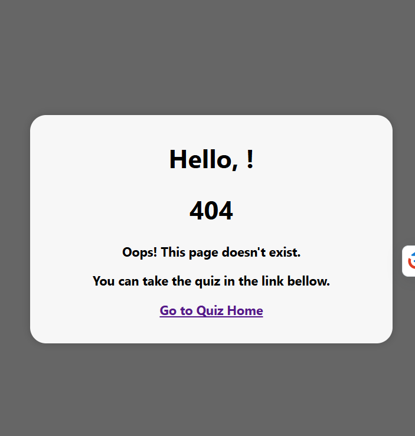
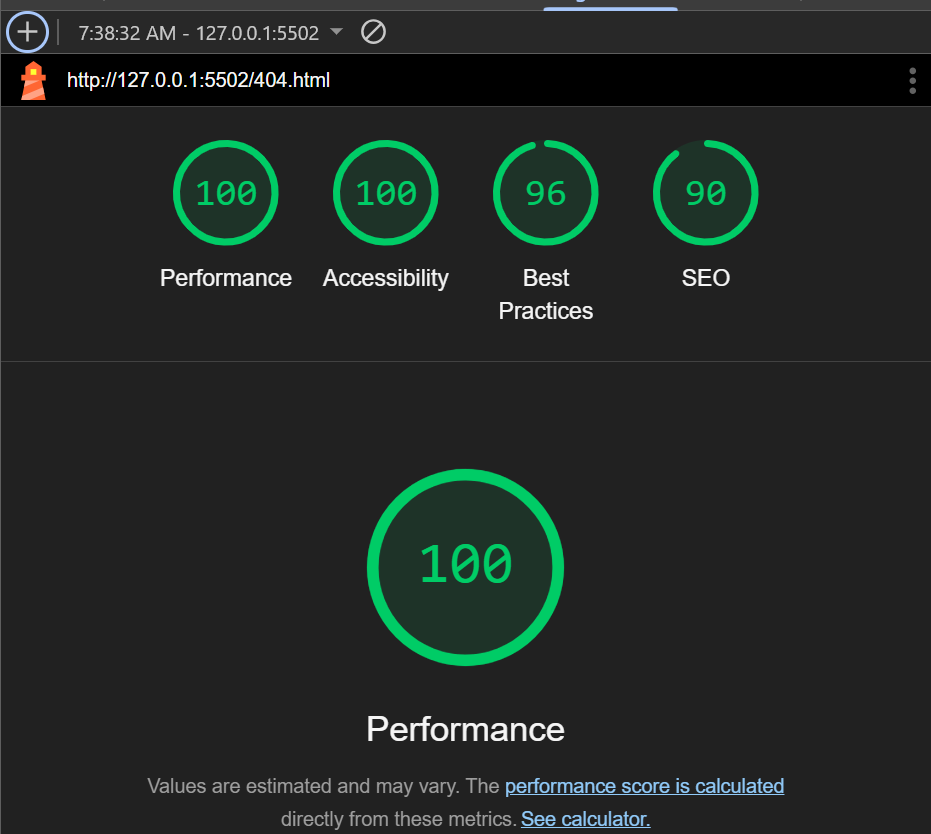
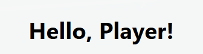

# Testing

> [!NOTE]
> Return back to the [README.md](README.md) file.

This Quiz Website has been manually tested and all intended functionality on the project board works. It also has been tested on the websites like  w3, Jigsaw validator, Jshint and it looks good. 
Outcome of the test results: The webpage opens, a player name can be entered in the modal, click "Start Quiz" works, answering the 10 shuffled questions works, the correct and incorrect counters updating are observed, and after the final question or when time runs out,the result message and "Play Again" button appears, the score is added to the high scores list (limited to the top 5), and clicking "Play Again" resets the quiz.

## Code Validation

### HTML

I have used the recommended [HTML W3C Validator](https://validator.w3.org) to validate all of my HTML files.

| Directory | File | URL | Screenshot | Notes |
| --- | --- | --- | --- | --- |
|  | [404.html](https://github.com/mairima/pp2-codequiz/blob/main/404.html) | [HTML Validator](https://validator.w3.org/nu/?doc=https://mairima.github.io/pp2-codequiz/404.html) |  |  |
|  | [index.html](https://github.com/mairima/pp2-codequiz/blob/main/index.html) | [HTML Validator](https://validator.w3.org/nu/?doc=https://mairima.github.io/pp2-codequiz/index.html) |  | Notes (background image works on github pages if in html, rather than in css in this case, which is only locally.) |

### CSS

I have used the recommended [CSS Jigsaw Validator](https://jigsaw.w3.org/css-validator) to validate all of my CSS files.

| Directory | File | URL | Screenshot | Notes |
| --- | --- | --- | --- | --- |
| assets | [style.css](https://github.com/mairima/pp2-codequiz/blob/main/assets/css/style.css) | [CSS Validator](https://jigsaw.w3.org/css-validator/validator?uri=https://mairima.github.io/pp2-codequiz) |  | |

### JavaScript

I have used the recommended [JShint Validator](https://jshint.com) to validate all of my JS files.

| Directory | File | URL | Screenshot | Notes |
| --- | --- | --- | --- | --- |
| assets | [script.js](https://github.com/mairima/pp2-codequiz/blob/main/assets/js/script.js) | N/A |  |  |

## Responsiveness

I've tested my deployed project to check for responsiveness issues.

| Page | Mobile | Tablet | Desktop | Notes |
| --- | --- | --- | --- | --- |
| Home |  |  |  | Works as expected |
| 404 |  |  |  | Works as expected |

## Browser Compatibility

I've tested my deployed project on multiple browsers to check for compatibility.

| Page | Chrome | Firefox | Edge | Notes |
| --- | --- | --- | --- | --- |
| Home |  |  |  | Works as expected |
| 404 |  |  |  | Works as expected |

## Lighthouse Audit

I've tested my deployed project using the Lighthouse Audit tool to check for any issues. Some warnings are outside of my control, and mobile results tend to be lower than desktop.

| Page | Mobile | Desktop |
| --- | --- | --- |
| Home |  |  |
| 404 |  |  |

## Defensive Programming

Defensive programming was manually tested with the below user acceptance testing:

| Page/Feature | Expectation | Test | Result | Screenshot |
| --- | --- | --- | --- | --- |
|Responsive design|All UI elements (question box, buttons, footer) remain fully visible and usable on all screen sizes. | Checked layout, font sizes, button accessibility, and visibility of all components |worked as expected. |  |
| Input Validation for Player Name |If the player name input is empty, the name should default to "Player." | Test if the default name "Player" appears when the input is empty. |worked as expected. |  |
| Valid Answer Selection| Once an answer is selected, the button should be disabled, and no further changes should be allowed.| Verified that once a button is clicked, other buttons are disabled. | The selected answer is locked, and other options are not be clickable. |  |
|Preventing timer from going below zero|The timer should stop at 0 seconds, and the quiz should automatically show the results when time runs out.| Ensured that the timer doesn’t go below zero, and the quiz ends when the timer runs out.| The timer stops at 0 and the results are shown automatically.|  |
| Buttons| Feature is expected to work, use high-contrast colors and accessible fonts. | The buttons work and the contrast is good | buttons are clickable, colors and fonts met accessibility standards. |  |
| Modal Display on Page Load-Description and User name entry | The modal should appear automatically when the page loads and prevent interaction with the quiz until a name is entered.| Reload the page. | Modal is visible, background is dimmed, and quiz buttons are inaccessible. |  |
| highscore Tracker | Feature is expected to track the number of correct and incorrect equations. | Performed multiple calculations (correct and incorrect) and checked the score tracker. | Score tracker updated correctly for all tested scenarios. |  |
| 404 Error Page | Feature is expected to display a 404 error page for non-existent pages. | Navigated to an invalid URL to test error handling. | A custom 404 error page was displayed as expected. |  |

## User Story Testing
Also here is the user Story Project board: [User Story](https://github.com/users/mairima/projects/5/views/1) 

| Target | Expectation | Outcome | Screenshot |
| --- | --- | --- | --- |
| As a user | I would like open the quiz on all browser windows| so that its flexible to participate |see responsive design feature image |
| As a user| I want to enter my name before starting the quiz| so that my score is visible and personalized.|See modal display on page load-description and user name entry in the defensive programming section.|
| As a user | I would like to see questions and answer options with buttons| so that I can choose the result. | See valid answer selection on defensive programming.|
| As a user | I would like the application to have clear and large buttons for each operator | so that I can easily select the correct one on any device. | See valid answer selection on defensive programming.|
| As a user | I would like the application to have high-contrast colors and accessible fonts | so that I can easily read and interact with it. |See valid answer selection on defensive programming.|
| As a user | I would liketo see a timer | so that I can be aware of the time used|See Preventing timer from going below zero section on the defensive programming section |
| As a user | I would like the app to show me the correct result if my answer was incorrect | so that I can know the correct answer. |See valid answer selection on defensive programming.|
| As a user | I would like to see the score I get| so I can push myself to improve more | Seehigh score tracker on defensive programming section |
| As a user | I would like to see a 404 error page if I get lost | so that i recognise when on an inexistent page.| See 404 error page on defensive programming section|

